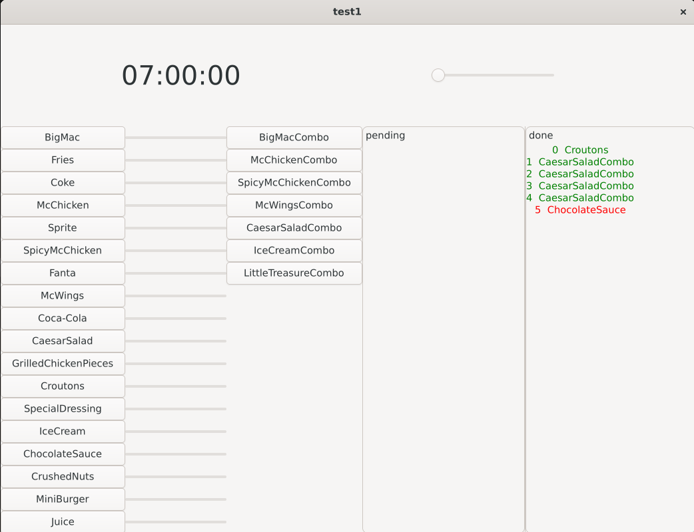
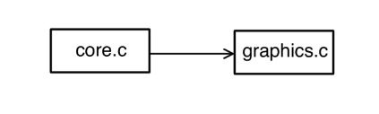

<style>
code {
    font-family: "Fira Code";
    font-feature-settings: "cv01", "cv02", "ss01", "cv12", "ss05", "ss03";
}
body {
    font-family: 'Segoe UI','Fira Code','DengXian' !important;
}
.supsub {
    display: inline-block;
}
.supsub sup,
.supsub sub {
    position: relative;
    display: block;
    font-size: .5em;
    line-height: 1.2;
}

.supsub sub {
    top: .3em;
}
</style>

# 概要设计--麦当劳点餐系统

### <p style="text-align: right;">小组成员：潘博晨 胡东鸣 陈霁阳</p>

### 本程序依赖GTK4，版本4.15.1 \ 开发环境：WSL Ubuntu 22.04.4

## 1. 输入输出设计

### GUI版:

- ### 输入

    

    可以通过按左边按钮在当前时间下对应订单，菜单文件`dict.dic`的输入同OJ版，不做赘述。
    滑动时间右侧滑动条可调整时间流速。按钮右侧为进度条，且显示存储量。

- ### 输出

    如图，右侧界面中左侧为当前未完成订单，右侧为已完成订单或失败订单，分别以绿色和红色表示。

## 2. 算法设计

1. 订单时间严格递增, 且后续订单不影响之前的订单, 所以可以挨行读取订单顺序处理, 顺序输出. 
2. 由题目需求, 每项食物只需维护一个达到存储上限 *cap<sub>i</sub>* 的时间 *captime<sub>i</sub>* .
3. 按按钮增加订单时即在此时插入新订单, 先于后续订单处理即可.
4. 其他按需模拟即可. 

## 3. 高层数据结构定义

- ### 三种结构体: 食物, 套餐, 订单. 

```
struct FOOD{
    char name[51];
    int cap, time, captime;
}food[100];

struct COMBO{
    char name[51];
    int count;
    int foodIndex[20];
}combo[100];

struct ORDER{
    int foodIndex[20];
    int count;
    int in, out;
};

typedef struct FOOD FOOD;
typedef struct COMBO COMBO;
typedef struct ORDER ORDER;

static ORDER* order;  //动态分配订单数组指针
```

- ### 三个文件指针

```
FILE* dict;
FILE* input;
FILE* output;
```

- ### 全局变量食物数, 套参数, 订单数， w1，w2

```
int foodCount, comboCount, orderCount, w1, w2;
```

## 4. 系统模块划分
### 1. 软件结构图

本程序共划分为两个模块, 各模块分别如下:

1. core.c: 读取和处理数据, 为GUI模块提供数据处理相关函数.
2. graphics.c: 主函数, GUI模块, 读取数据, 提供GUI.

软件结构图如图所示:



### 2. 文件及函数组成

| 源文件     | 源文件说明   | 函数名              | 功能                                      |
| ---------- | ------------ | ------------------- | ----------------------------------------- |
| core.c     | 数据处理相关 | secPrint            | 将秒转换成时间输出                        |
|            |              | time2sec            | 将时间转换成秒                            |
|            |              | searchInFood        | 在食物中搜索名字, 返回在food数组中的下标  |
|            |              | searchInCombo       | 在套餐中搜索名字, 返回在combo数组中的下标 |
|            |              | dictRead            | 读取菜单文件                              |
|            |              | orderRead           | 读订单                                    |
|            |              | cmp                 | qsort的比较函数                           |
|            |              | w2thBigSec          | 返回在订单数组中前i个中第w2大的输出的时间 |
|            |              | isImmediateComplete | 判断订单是否立即完成                      |
|            |              | ithOrderHandle      | 订单处理                                  |
|            |              | orderOutput         | 订单输出                                  |
|            |              | inputRead           | 读取输入                                  |
|            |              | fileOpen            | 打开文件                                  |
|            |              | fileClose           | 关闭文件                                  |
| graphics.c | GUI模块      | clicked             | 点击事件                                  |
|            |              | create_menu_buttons | 创建菜单按钮                              |
|            |              | order_pane_create   | 创建订单对应显示区域                      |
|            |              | create_all          | 所有页面创建                              |
|            |              | app_startup         | 启动                                      |
|            |              | get_time            | 获取当前时间                              |
|            |              | <待定>              | <待定>                                    |

## 5. 高层算法设计

### 下面给出几个高层算法的伪代码

1. 订单处理函数

```
function orderHandle()
    closeSec = -1
    openSec = -1

    for each order from 0 to orderCount - 1 do
        if (order.in > closeSec and order.in < openSec) or order.in > time2sec("22:00:00") then
            order.out = -1
            continue

        if isImmediateComplete(order) then
            order.out = order.in
            for each food in order do
                currentFood = get food by index
                if order.in <= currentFood.captime then
                    currentFood.captime = currentFood.captime + currentFood.time
                else
                    currentFood.captime = order.in + currentFood.time
            continue

        out = 0
        for each food in order do
            currentFood = get food by index
            n = currentFood.captime - (currentFood.cap - 1) * currentFood.time
            if n >= order.in and out < n then
                out = n
            if order.in <= currentFood.captime then
                currentFood.captime = currentFood.captime + currentFood.time
            else
                currentFood.captime = order.in + currentFood.time
            order.out = out

        afterCount = 0
        for each previousOrder from 0 to currentOrder - 1 do
            if previousOrder.out > order.in then
                afterCount = afterCount + 1

        if afterCount == w1 then
            closeSec = order.in
            openSec = w2thBigSec(currentOrder + 1) + 1

```

2. 菜单读取函数
```
function dictRead(dict)
    read foodCount and comboCount from dict

    for each food from 0 to foodCount - 1 do
        read food.name from dict

    for each food from 0 to foodCount - 1 do
        read food.time from dict

    for each food from 0 to foodCount - 1 do
        read food.cap from dict

    read w1 and w2 from dict

    for each food from 0 to foodCount - 1 do
        food.captime = food.cap * food.time

    for each combo from 0 to comboCount - 1 do
        read combo.name from dict
        combo.count = 0

        repeat
            read name from dict
            combo.foodIndex[combo.count] = searchInFood(name)
            combo.count = combo.count + 1

            c = read next character from dict
            if c is newline or EOF then
                break
        until end of file

```

3. 订单读取函数
```
function orderRead(input)
    for each order from 0 to orderCount - 1 do
        initialize order.foodIndex to -1 for each index from 0 to 19
        order.out = 0

        read time and orderName from input
        order.in = time2sec(time)

        temp = searchInFood(orderName)
        if temp is not -1 then
            order.count = 1
            order.foodIndex[0] = temp
        else
            temp = searchInCombo(orderName)
            for each food in combo[temp] do
                order.foodIndex[j] = combo[temp].foodIndex[j]
            order.count = combo[temp].count

```