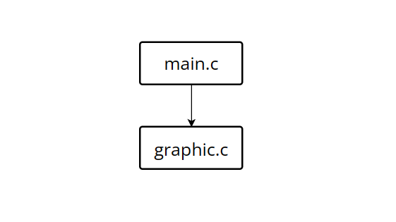

<style>
code {
    font-family: "Fira Code";
    font-feature-settings: "cv01", "cv02", "ss01", "cv12", "ss05", "ss03";
}
body {
    font-family: 'Segoe UI','Fira Code','DengXian' !important;
}
p {
    font-size: large;
}
li {
    font-size: large;
}
table {
    font-size: large;
}
h3 {
    font-size: large;
}
.supsub {
    display: inline-block;
}
.supsub sup,
.supsub sub {
    position: relative;
    display: block;
    font-size: .5em;
    line-height: 1.2;
}

.supsub sub {
    top: .3em;
}
</style>
# 概要设计--麦当劳点餐系统

## 1. 输入输出设计

### OJ版:

- ### 输入

    第一行包含一个整数 *n* (1 ≤ *n* ≤ 54001)表示订单个数。

    第二行包含两个整数 *W*<sub>1</sub>, *W*<sub>2</sub>(2 ≤ *W*<sub>2</sub> ≤ *W*<sub>1</sub> ≤ 100)。

    第三行包含𝑁个整数 *t*<sub>1</sub>, *t*<sub>2</sub>, . . . , *t*<sub>*N*</sub>(1 ≤ *t*<sub>*i*</sub> ≤ 70)，其中 *t*<sub>*i*</sub> 表示第 *i* 种食物的制作时长。

    第四行包含𝑁个整数𝑐𝑎𝑝<sub>1</sub>, 𝑐𝑎𝑝<sub>2</sub>, . . . , 𝑐𝑎𝑝<sub>*N*</sub> (1 ≤ 𝑐𝑎𝑝<sub>*i*</sub> ≤ *n*)，其中𝑐𝑎𝑝<sub>*i*</sub>表示第 *i* 种食物的最大存储容量。

    对于接下来的 *n* 行，用格式类似于11: 11: 11的方式，给出第 *i* 个订单的时间。然后输入一个字符串 *type*<sub>*i*</sub> 表示套餐或食物的名称(参见 dict.dic)。所有订单时间一定在[07: 00: 00,22: 00: 00]内，同一个时间点不可能出现多个订单，第 *i* − 1个订单一定早于第 *i*个(2 ≤ *i* ≤ *n*)，且保证 23:59:59(含)前一定能完成所有订单。

    具体参见 input.txt

- ### 输出

    输出包括 *n* 行，按照订单顺序输出订单完成时间。对于第 *i* 行，如果第 *i* 个订单不成功，则输出 Fail；否则，输出这个订单完成的时间，时间格式与输入格式 ( 11: 11: 11 ) 一致。

    具体参见 output.txt

---

### GUI版: <待定>

- ### 输入

    第一行包含一个整数 *n* (1 ≤ *n* ≤ 54001)表示订单个数。

    第二行包含两个整数 *W*<sub>1</sub>, *W*<sub>2</sub>(2 ≤ *W*<sub>2</sub> ≤ *W*<sub>1</sub> ≤ 100)。

    第三行包含𝑁个整数 *t*<sub>1</sub>, *t*<sub>2</sub>, . . . , *t*<sub>*N*</sub>(1 ≤ *t*<sub>*i*</sub> ≤ 70)，其中 *t*<sub>*i*</sub> 表示第 *i* 种食物的制作时长。

    第四行包含𝑁个整数𝑐𝑎𝑝<sub>1</sub>, 𝑐𝑎𝑝<sub>2</sub>, . . . , 𝑐𝑎𝑝<sub>*N*</sub> (1 ≤ 𝑐𝑎𝑝<sub>*i*</sub> ≤ *n*)，其中𝑐𝑎𝑝<sub>*i*</sub>表示第 *i* 种食物的最大存储容量。

    对于接下来的 *n* 行，用格式类似于11: 11: 11的方式，给出第 *i* 个订单的时间。然后输入一个字符串 *type*<sub>*i*</sub> 表示套餐或食物的名称(参见 dict.dic)。所有订单时间一定在[07: 00: 00,22: 00: 00]内，同一个时间点不可能出现多个订单，第 *i* − 1个订单一定早于第 *i*个(2 ≤ *i* ≤ *n*)，且保证 23:59:59(含)前一定能完成所有订单。

    具体参见 input.txt

- ### 输出

    输出包括 *n* 行，按照订单顺序输出订单完成时间。对于第 *i* 行，如果第 *i* 个订单不成功，则输出 Fail；否则，输出这个订单完成的时间，时间格式与输入格式 ( 11: 11: 11 ) 一致。

    具体参见 output.txt

## 2. 算法设计

1. 订单时间严格递增, 且后续订单不影响之前的订单, 所以可以挨行读取订单顺序处理, 顺序输出. 
2. 由题目需求, 每项食物只需维护一个达到存储上限 *cap<sub>i</sub>* 的时间 *captime<sub>i</sub>* .
3. 其他按需模拟即可. 

## 3. 高层数据结构定义

- ### 三种结构体: 食物, 套餐, 订单. 

```
struct FOOD{
    char name[30];
    int cap, time, captime;
}food[100];

struct COMBO{
    char name[30];
    int count;
    int foodIndex[20];
}combo[100];

struct ORDER{
    int foodIndex[20];
    int count;
    int in, out;
};

typedef struct FOOD FOOD;
typedef struct COMBO COMBO;
typedef struct ORDER ORDER;

static ORDER* order;  //动态分配订单数组指针
```

- ### 三个文件指针

```
FILE* dict;
FILE* input;
FILE* output;
```

- ### 全局变量食物数, 套参数, 订单数

```
int foodCount, comboCount, orderCount;
```

## 4. 系统模块划分
### 1. 软件结构图

本程序共划分为两个模块, 各模块分别如下:

1. 源文件 main.c: 主函数, 读取和处理数据, 为GUI模块提供接口.
2. 画图模块 graphic.c: GUI模块, 读取数据, 提供GUI.

软件结构图如图所示:


### 2. 文件及函数组成

| 源文件    | 源文件说明 | 函数名              | 功能                                      |
| --------- | ---------- | ------------------- | ----------------------------------------- |
| main.c    | 主函数     | secPrint            | 将秒转换成时间输出                        |
|           |            | time2sec            | 将时间转换成秒                            |
|           |            | searchInFood        | 在食物中搜索名字, 返回在food数组中的下标  |
|           |            | searchInCombo       | 在套餐中搜索名字, 返回在combo数组中的下标 |
|           |            | dictRead            | 读取菜单文件                              |
|           |            | orderRead           | 读订单                                    |
|           |            | cmp                 | qsort的比较函数                           |
|           |            | w2thBigSec          | 返回在订单数组中前i个中第w2大的输出的时间 |
|           |            | isImmediateComplete | 判断订单是否立即完成                      |
|           |            | orderHandle         | 订单处理                                  |
|           |            | orderOutput         | 订单输出                                  |
|           |            | inputRead           | 读取输入                                  |
| graphic.c | GUI模块    | <待定>              | <待定>                                    |
## 5. 高层算法设计

### 下面给出几个高层算法的伪代码

1. 订单处理函数

```
Procedure orderHandle(w1, w2, curCloseSec, curOpenSec)
    For i = 0 to orderCount - 1
        If order[i].in > *curCloseSec AND order[i].in < *curOpenSec AND NOT isImmediateComplete(i) Then
            order[i].out = -1
            Continue
        End If
        
        If isImmediateComplete(i) Then
            order[i].out = order[i].in
            For j = 0 to order[i].count - 1
                Set curr = food[order[i].foodIndex[j]]
                If order[i].in <= curr.captime Then 
                    curr.captime += curr.time
                Else 
                    curr.captime = order[i].in + curr.time
                End If
            Next j
            Continue
        End If
        
        Set afterCount = 0
        For j = 0 to i - 1
            If order[j].out > order[i].in Then 
                afterCount++
            End If
        Next j
        
        Set out = 0
        For j = 0 to order[i].count - 1
            Set curr = food[order[i].foodIndex[j]]
            Set n = curr.captime - (curr.cap - 1) * curr.time
            If n >= order[i].in AND out < n Then 
                out = n
            End If
            If order[i].in <= curr.captime Then 
                curr.captime += curr.time
            Else 
                curr.captime = order[i].in + curr.time
            End If
            order[i].out = out
        Next j
        
        If afterCount + 1 = w1 Then
            *curCloseSec = order[i].in
            *curOpenSec = w2thBigSec(i, w2) + 1
        End If
    Next i
End Procedure

```

2. 菜单读取函数
```
Procedure dictRead(dict)
    Read foodCount, comboCount from dict
    For i = 0 to foodCount - 1
        Read food[i].name from dict
    Next i
    For i = 0 to comboCount - 1
        Read combo[i].name from dict
        Set combo[i].count = 0
        Repeat
            Read name from dict
            Set combo[i].foodIndex[combo[i].count] = searchInFood(name)
            Set c = fgetc(dict)
            If c == 13 OR c == 10 Then 
                Break
            End If
            If c == EOF Then 
                Return
            End If
            Increment combo[i].count
        Until False
    Next i
End Procedure
```

3. 订单读取函数
```
Procedure orderRead(input)
    For i = 0 to orderCount - 1
        For j = 0 to 19
            Set order[i].foodIndex[j] = -1
        Next j
        Set order[i].out = 0
        Set time and orderName to empty strings
        Read time and orderName from input
        Set order[i].in = time2sec(time)
        Set temp = searchInFood(orderName)
        If temp != -1 Then
            Set order[i].count = 1
            Set order[i].foodIndex[0] = temp
        Else
            Set temp = searchInCombo(orderName)
            For j = 0 to combo[temp].count - 1
                Set order[i].foodIndex[j] = combo[temp].foodIndex[j]
            Next j
            Set order[i].count = combo[temp].count
        End If
    Next i
End Procedure
```